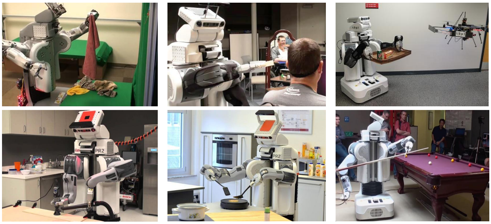
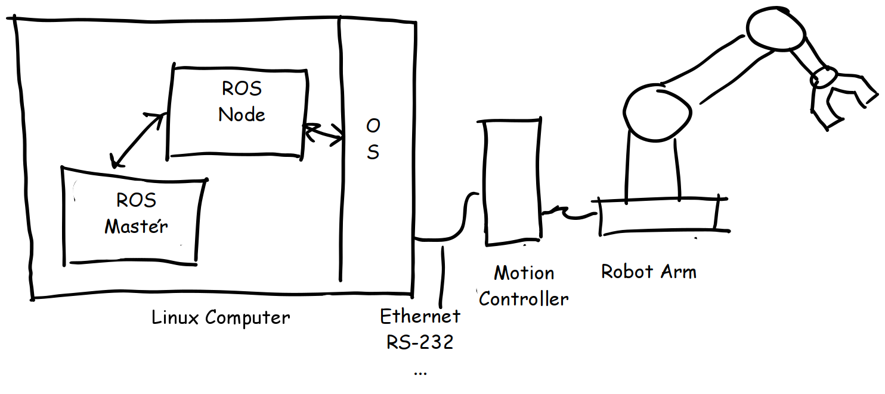
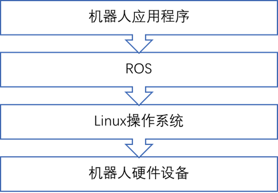
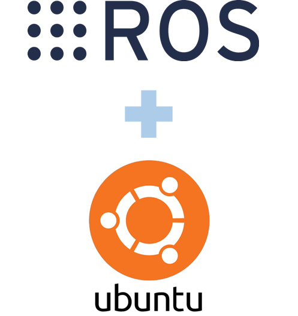
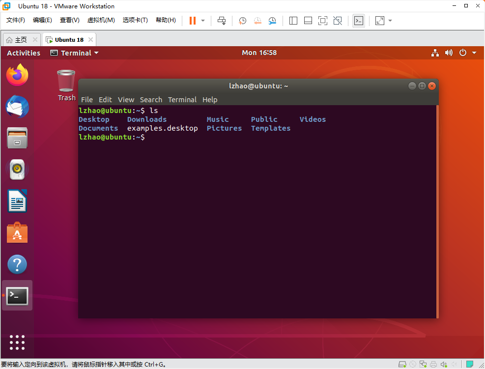
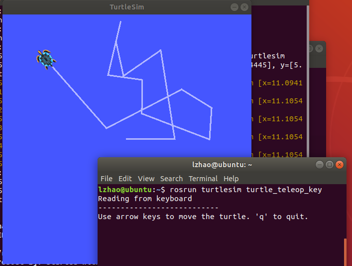

# ROS学习笔记

**作者：** L Zhao，欢迎加入协同编辑！

ROS是机器人操作系统（Robot Operating System）的英文缩写，ROS的首要目标是提供一套统一的开源程序框架，用以在多样化的现实世界与仿真环境中实现对机器人的控制。

我们希望读者通过这篇笔记，对ROS能有比较直观的理解，能够自行搭建起一个ROS的实验平台，并具备在此基础上进一步学习的能力。介于机器人系统本身的复杂性，笔记中只会对ROS学习过程中的重点和难点给出简要描述，而具体的细节和代码将通过链接的方式给出。

在学习ROS的同时，我们开展了LIBRO图书管理机器人（LIBrary management RObot）项目，并在GitHub上开放了源代码，地址：https://github.com/df-club/libro ，欢迎大家共同学习交流！

## 一、ROS简介

在阅读这篇笔记之前，我设想你已经有了设计制作一个机器人系统的需求，不管是学习还是工作的需要，但你很可能还是一个菜鸟，希望了解是否需要学习ROS，ROS到底能够做些什么，进一步思考如何着手实施项目。

**第一个问题，是否要学习ROS？**

这取决于你的需求，如果你的需求中包括机器人的定位、导航、视觉、机械臂控制、多种传感器的融合等等功能，那恭喜你，你可能不得不下定决心开始学习ROS。学习ROS的门槛并不低，需要具备或者学习相关的程序设计、计算机系统、人工智能、机械设计、运动学和动力学等知识，这要投入大量的时间精力，如果想要在物理世界实现出来，还包括至少数千元的硬件成本。

你想拥有一台下图中那样的会打台球的ROS机器人吗？只需40万美金就能带回家！

**第二个问题，ROS是什么？**

ROS从定义上看，首先是一个操作系统，操作系统的主要功能是管理计算机的硬件和软件资源，比如大家熟悉的windows操作系统。如果没有操作系统，电脑有了基本等于没有，因为现在几乎所有的应用都是建立在操作系统所提供的服务之上的。ROS作为一款机器人操作系统，其最核心的功能也就是管理机器人系统中的硬件和软件资源，并为更高层的应用提供服务，例如操控一个机械臂抓取物品。

关于ROS更多介绍请参考：https://blog.csdn.net/qq_25267657/article/details/84316111

**第三个问题，如何开始？**

万事开头难，如果你决定要学习ROS，那么你需要做如下准备工作：

1. 根据自己在相关领域的基础，准备投入至少数十小时的学习时间；
2. 准备一台主流性能的电脑，用于ROS环境搭建（做好数据备份工作）；
3. 如果准备在物理环境下搭建机器人实体，开始存钱或者寻找经费支持；
4. OK，let's go!

## 二、ROS环境搭建

ROS虽然叫操作系统，但却不像我们通常所说的操作系统那样可以直接安装到硬件上，而是需要运行在Linux操作系统环境下，通过Linux来控制具体的硬件设备。如下图所示，在这种层次结构中，ROS可以方便地调用Linux所提供的各种功能，降低了系统开发的复杂程度，并且借助Linux实现了一定的跨平台能力。所以，搭建ROS环境的第一步是安装Linux操作系统。

### 1. 安装Linux操作系统

ROS官方推荐采用Ubuntu操作系统，Ubuntu是一种“桌面级”的Linux系统，它提供了较为完善的图形化交互环境和应用程序生态，非常适合新手学习使用。本文中所采用的ROS版本为ROS Melodic Morenia，官方推荐安装在Ubuntu Bionic Beaver 18.04系统环境中。

ROS还在不断升级更新，并推出了ROS2.0版，将支持包括Windows在内的多种系统平台，以及其他方面的改进提升，具体请参考：https://blog.csdn.net/brawly/article/details/106435843 。新版本虽然提供了很多新特性，但学习资料相对较少，而且系统稳定性还有待提升。因此，还是推荐初学者按照文章内容先将整个流程操作一遍，熟悉功能和用法之后再去尝鲜。

**情况1：虚拟机安装Ubuntu系统**

通过虚拟机安装Ubuntu系统是最保险的一种方式，不会对你电脑本身的系统和数据造成影响，建议初学者可以先通过虚拟机方式来了解Linux系统和ROS的基本操作方法。采用这种方式，我们首先需要在Windows系统中安装虚拟机程序，一般使用VMware，通过虚拟机程序来建立一个虚拟化的计算机硬件资源，再在虚拟机中安装Ubuntu操作系统。

因为虚拟机只是Windows系统中的一个应用程序，所以在这个应用程序“盒子”中安装的Ubuntu并不会影响到外部电脑的正常使用。当然这种“套娃”结构，以及虚拟化技术本身的限制，导致虚拟机的性能较差，日常使用还能应付，一旦涉及复杂运算或仿真环境时就可能会有卡顿甚至无法运行的情况出现。所以如果虚拟机已经无法满足你的实际需要，就要考虑直接在硬盘上安装Ubuntu系统了。

具体步骤请参考：https://blog.csdn.net/qq_39557270/article/details/102926282

**情况2：硬盘安装Ubuntu或双系统**

硬盘安装意味着Ubuntu系统可以直接调用计算机硬件资源，从而相较于虚拟机环境大幅提高运行效率。如果你有一台电脑专门用来学习ROS，那你可以直接安装Ubuntu代替电脑中的原有系统；而如果你需要保留电脑中原有的Windows系统环境，那推荐采用双系统模式（Windows+Ubuntu），在每次开机时可以选择进入相应的系统环境。硬盘安装与虚拟机安装Ubuntu的方式差异不大，需要注意的是硬盘分区和Boot（也就是启动选项的部分），以防万一建议初学者在安装前备份重要数据。

具体步骤请参考：https://www.cnblogs.com/jsdy/p/11420118.html

**情况3：在Jetson上安装Ubuntu系统**

出于对体积和功耗方面的考量，很多机器人系统会选择部署在嵌入式硬件平台上，常见的如树莓派或者NVIDIA Jetson开发版，如果涉及机器视觉相关应用，建议购买性能更强劲的Jetson。

关于如何在Jetson上安装使用Ubuntu系统，可以参考我们之前的文章：https://mp.weixin.qq.com/s/tGkvyF7yi3eBiuwgPvjfNA

### 2. 安装和配置ROS环境

由于国内用户访问国外网址时常会出现速度慢、连接不稳定等问题，因此在安装好Ubuntu之后，首先需要更换系统默认数据源，从而提高系统更新、软件包下载的速度。具体方法请参考：https://blog.csdn.net/zhangjiahao14/article/details/80554616 。需要注意，不同版本的Ubuntu更换数据源时所修改的文件内容略有差异。

接下来就可以安装ROS了，具体可参考ROS官网的帮助文档：http://wiki.ros.org/cn/melodic/Installation/Ubuntu ，建议直接安装的ROS桌面完整版（Desktop-Full）。安装过程中可能遇到rosdep update连接超时的问题，解决方法可参考：https://www.cnblogs.com/stpaul/articles/14805360.html 。

### 3. 测试ROS

为了检验安装是否成功，这里使用ROS自带的程序案例来进行测试。这里只列出基本步骤，具体可参考：http://wiki.ros.org/cn/ROS/Tutorials/UnderstandingTopics 。

在Ubuntu中打开3个终端，在终端分别输入下列命令并回车执行；

1. 在终端1中输入：roscore
2. 在终端2中输入：rosrun turtlesim turtlesim_node，会弹出有一只海龟的图形化窗口；
3. 在终端3中输入：rosrun turtlesim turtle_teleop_key，在终端3中按下键盘上的上下左右键，即可控制海龟的运动。

通过运行该案例，除了可以测试ROS的安装是否成功以外，我们还能初步了解到ROS工作的基本原理。在该案例中，每个终端中都运行了一个程序，终端2里的海龟是对移动机器人平台的模拟，终端3的功能则相当于遥控器。在ROS中，两个程序间通过某种方式进行通信，从而实现通过遥控器控制机器人的运动。

在下一节中，我们将伴着这只小海龟，继续学习ROS的工作原理和使用方法，加油！

## 三、ROS基础功能

## 四、ROS建模仿真

## 五、ROS进阶功能

