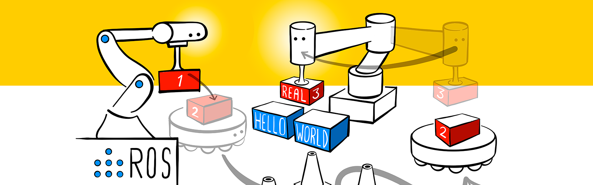

# ROS学习笔记

**作者：** L Zhao，欢迎加入协同编辑！

ROS是机器人操作系统（Robot Operating System）的英文缩写，ROS的首要目标是提供一套统一的开源程序框架，用以在多样化的现实世界与仿真环境中实现对机器人的控制。

我们希望读者通过这篇笔记，对ROS能有比较直观的理解，能够自行搭建起一个ROS的实验平台，并具备在此基础上进一步学习的能力。介于机器人系统本身的复杂性，笔记中只会对ROS学习过程中的重点和难点给出简要描述，而具体的细节和代码将通过链接的方式给出。

在学习ROS的同时，我们开展了LIBRO图书管理机器人（LIBrary management RObot）项目，并在GitHub上开放了源代码，地址：https://github.com/df-club/libro ，欢迎大家共同学习交流！

## ROS简介

在阅读这篇笔记之前，我设想你已经有了设计制作一个机器人系统的需求，不管是学习还是工作的需要，但你很可能还是一个菜鸟，希望了解是否需要学习ROS，ROS到底能够做些什么，进一步思考如何着手实施项目。

**第一个问题，是否要学习ROS？**

这取决于你的需求，如果你的需求中包括机器人的定位、导航、视觉、机械臂控制、多种传感器的融合等等功能，那恭喜你，你可能不得不下定决心开始学习ROS。学习ROS的门槛并不低，需要具备或者学习相关的程序设计、计算机系统、人工智能、机械设计、运动学和动力学等知识，这要投入大量的时间精力，如果想要在物理世界实现出来，还包括至少数千元的硬件成本。

你想拥有一台下图中那样的会打台球的ROS机器人吗？只需40万美金就能带回家！

**第二个问题，ROS是什么？**

ROS从定义上看，首先是一个操作系统，操作系统的主要功能是管理计算机的硬件和软件资源，比如大家熟悉的windows操作系统。如果没有操作系统，电脑有了基本等于没有，因为现在几乎所有的应用都是建立在操作系统所提供的服务之上的。ROS作为一款机器人操作系统，其最核心的功能也就是管理机器人系统中的硬件和软件资源，从而为更高层的应用，例如操控一个机械臂抓取物品，提供服务。

关于ROS更多介绍请参考：https://blog.csdn.net/qq_25267657/article/details/84316111

**第三个问题，如何开始？**

万事开头难，如果你决定要学习ROS，那么你需要做如下准备工作：

1. 准备一台主流性能的电脑，用于安装Linux系统或者配置Linux虚拟机；
2. 在安装系统之前做好数据备份工作，或着稳妥起见使用一台备用电脑；
3. 或者采用可以运行Linux操作系统的其他设备，比如NVDIA Jetson；
4. OK，let's go!

## ROS环境搭建

ROS虽然叫操作系统，但却不像我们通常所说的操作系统那样可以直接安装到硬件上，而是需要运行在Linux操作系统环境下，通过Linux来控制具体的硬件设备。如下图所示，在这种层次结构中，ROS可以方便地调用Linux所提供的各种功能，降低了系统开发的复杂程度，并且借助Linux实现了一定的跨平台能力。所以，搭建ROS环境的第一步是安装Linux操作系统。

### 1. 安装Linux操作系统

ROS目前只能在基于Unix的平台上运行。ROS的软件主要在Ubuntu和Mac OS X 系统上测试，同时ROS社区仍持续支持Fedora，Gentoo，Arch Linux和其它Linux平台。 

情况1：硬件安装Ubuntu系统或双系统

情况2：虚拟机安装系统

情况3：在Jetson上安装系统

### 2. 安装ROS

### 3. 配置ROS

### 4. 测试ROS

## ROS基础功能

## ROS建模仿真

## ROS进阶功能

